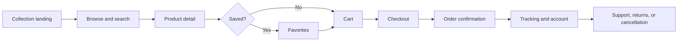

<div align="center">


# ALOTHING

### A considered fashion commerce experience for every wardrobe

<p>Discover collections, explore product details, save favorites, manage your cart, and follow every order from one polished storefront.</p>

<a href="http://localhost/alothing2/index.html">Open Storefront</a>
&nbsp;&nbsp;•&nbsp;&nbsp;
<a href="admin/index.html">Explore Admin Panel</a>

<br><br>


</div>

<br>

<table align="center">
<tr>
<td align="center" width="25%"><strong>01</strong><br><sub>Curated storefronts</sub></td>
<td align="center" width="25%"><strong>02</strong><br><sub>Complete shopping flow</sub></td>
<td align="center" width="25%"><strong>03</strong><br><sub>Customer self-service</sub></td>
<td align="center" width="25%"><strong>04</strong><br><sub>Operations command center</sub></td>
</tr>
</table>

> **Project status** — A functional local-development e-commerce application. Before production use, complete the security, configuration, payment, and database hardening described in [Production Considerations](#production-considerations).

## Contents

- [Highlights](#highlights)
- [Application Areas](#application-areas)
- [Technology Stack](#technology-stack)
- [Project Structure](#project-structure)
- [Requirements](#requirements)
- [Local Installation](#local-installation)
- [Database](#database)
- [Email Configuration](#email-configuration)
- [How the Main Flows Work](#how-the-main-flows-work)
- [API Reference](#api-reference)
- [Administration](#administration)
- [Development Notes](#development-notes)
- [Production Considerations](#production-considerations)
- [Known Limitations](#known-limitations)

## Product Experience

ALOTHING brings the complete shopping journey into one coherent flow:



## Highlights

| Shopping | Account | Operations |
| --- | --- | --- |
| Women's and men's collections | Profile and saved addresses | Dashboard analytics |
| Search, categories, variants, and discounts | Order history and details | Product and image management |
| Galleries, favorites, reviews, and restock requests | Cancellation and return requests | Size-level stock control |
| Cart, coupons, shipping, and checkout | Password and email changes | Orders, coupons, users, messages, and comments |
| Public order tracking | Contact and support messages | Status updates and notifications |

## Application Areas

### Customer storefront

| Area | Pages | Capabilities |
| --- | --- | --- |
| Entry and discovery | `index.html`, `kadinAnasayfa.html`, `erkekAnasayfa.html`, `category.html` | Choose a collection, browse featured products, filter by category, and search products. |
| Product shopping | `product-detail.html`, `favorites.html` | View galleries and variants, select sizes, add items to the cart, save favorites, read and submit reviews, and request restock notifications. |
| Checkout | `checkout.html` | Select or create an address, calculate shipping, apply coupons, review the cart, and create an order. |
| Account | `account.html`, `order-detail.html` | Manage profile and addresses, view orders, request cancellation/returns, update credentials, and delete the account. |
| Delivery | `order-tracking.html` | Look up an order publicly and view its shipment progress. |
| Support and information | `contact.html`, `faq.html`, `about.html`, `privacy.html`, `terms.html`, `returns-and-delivery.html` | Contact support and read store policies and information pages. |
| Authentication | `login.php`, `register.php`, `forgot-password.html`, `reset-password.html` | Register, sign in, request a password reset, and set a new password. |

Shared navigation and footer markup are loaded from `navbar.html` and `footer.html` by the frontend scripts.

### Administration

The `admin/` directory contains the management interface:

- `index.html`: dashboard statistics, sales chart, popular products, recent orders, and quick actions.
- `orders.html`: search and manage orders, update statuses, process cancellation/return requests, and create tracking codes.
- `products.html`: add, edit, delete, and upload products with categories, variants, images, and model information.
- `stocks.html`: inspect and bulk-update stock counts for individual sizes.
- `users.html`: inspect and delete customer accounts.
- `coupons.html`: create and delete discount coupons.
- `messages.html`: read customer support messages and send replies.
- `comments.html`: approve, reject, hide, or republish product comments.

## Technology Stack

- **Frontend:** HTML5, CSS3, vanilla JavaScript, Bootstrap 5 assets, Lightbox, and Chart.js via CDN in the admin dashboard.
- **Backend:** PHP endpoint scripts using `mysqli`, JSON request/response bodies, PHP sessions, and password hashing.
- **Database:** MySQL or MariaDB. The application currently expects a database named `alothing_db`.
- **Email:** PHPMailer, stored locally in `PHPMailer/src`, configured for Gmail SMTP over STARTTLS.
- **Runtime:** Apache and PHP through XAMPP for local development.

There is currently no `composer.json`, SQL dump, migration system, environment file, automated test suite, or build step.

## Project Structure

```text
alothing2/
├── index.html                  # Gender selection entry point
├── kadinAnasayfa.html          # Women's storefront
├── erkekAnasayfa.html          # Men's storefront
├── category.html               # Catalog and search view
├── product-detail.html         # Product details and reviews
├── checkout.html               # Cart checkout
├── account.html                # Customer account area
├── order-detail.html           # Customer order details
├── order-tracking.html         # Public tracking page
├── admin/                      # Admin dashboard and management views
├── css/                        # Bootstrap, Lightbox, and application styles
├── js/                         # Cart, auth, catalog, checkout, account, and UI logic
├── images/                     # Storefront and product imagery
├── PHPMailer/src/              # Vendored PHPMailer classes
├── *.php                       # JSON APIs and server-side operations
└── README.md
```

## Requirements

- Windows with [XAMPP](https://www.apachefriends.org/), including Apache, PHP, and MySQL/MariaDB.
- PHP extensions for `mysqli`, JSON, sessions, password hashing, and OpenSSL.
- PHP upload limits suitable for product images (`upload_max_filesize` and `post_max_size`).
- A browser with JavaScript enabled.
- Gmail SMTP credentials or another SMTP service configured in the mail scripts.

## Local Installation

1. Copy the project into the XAMPP web root:

	```text
	C:\xampp\htdocs\alothing2
	```

2. Start **Apache** and **MySQL** in the XAMPP Control Panel.

3. Create a MySQL database named `alothing_db` in phpMyAdmin or the MySQL console.

4. Create the tables described in [Database](#database). The repository does not currently include a schema or seed SQL file, so the database must be prepared separately.

5. Review every PHP connection statement. The current default is:

	```php
	new mysqli("localhost", "root", "", "alothing_db");
	```

	This assumes the local XAMPP `root` user has an empty password.

6. Configure SMTP as described in [Email Configuration](#email-configuration).

7. Open the application through Apache, not by opening the HTML file directly:

	```text
	http://localhost/alothing2/index.html
	```

8. Create a user and set its `role` column to `admin` to access the admin interface.

## Database

The following schema is inferred from the SQL used by the application. Column types should be selected and indexed appropriately when creating the database.

| Table | Important columns | Purpose |
| --- | --- | --- |
| `users` | `id`, `full_name`, `name`, `surname`, `email`, `password`, `phone`, `gender`, `tc_no`, `address`, `city`, `district`, `role`, `reset_token`, `reset_expires`, `created_at` | Customer accounts and roles. |
| `products` | `id`, `name`, `ref`, `category`, `price`, `old_price`, `discount`, `images`, `sizes`, `colors`, `model_info`, `color_group_id` | Product catalog and variant metadata. |
| `product_stocks` | `id`, `product_id`, `size`, `stock_count` | Stock per product and size. A unique key on `(product_id, size)` is expected by stock synchronization. |
| `orders` | `id`, `user_email`, `phone`, `order_code`, `items`, `total_price`, delivery fields, `status`, `tracking_code`, `cancel_reason`, `created_at` | Orders, serialized line items, delivery details, and fulfillment state. |
| `addresses` | `id`, `user_email`, `address_title`, `name`, `surname`, `phone`, `address_line`, `zip_code`, `city`, `district` | Saved customer addresses. |
| `favorites` | `id`, `email`, `product_id` | Customer saved products. |
| `product_comments` | `id`, `product_id`, `user_email`, `user_name`, `rating`, `comment`, `status`, `created_at` | Product reviews and moderation status. |
| `coupons` | `id`, `code`, `discount_type`, `discount_value`, `min_cart_amount`, `created_at` | Discount codes. |
| `contact_messages` | `id`, `name`, `email`, `order_no`, `message`, `status`, `admin_reply`, `reply_date`, `created_at` | Customer support conversations. |
| `stock_requests` | `id`, `user_email`, `product_id`, `size`, `status` | Restock notification requests. |

### Important schema note

`register.php` writes `full_name`, while other account operations also refer to `name` and `surname`. Reconcile this naming convention in the database and PHP endpoints before relying on profile data. Product categories, images, and sizes are currently stored as comma-separated values, colors may be JSON, and order items are stored as JSON text.

## Email Configuration

`send_mail.php` exposes the `sendOrderEmail($to, $subject, $htmlContent)` helper. PHPMailer is used for:

- Order confirmation after `create_order.php` succeeds.
- Shipment, delivery, cancellation, and return notifications from `update_status.php`.
- Password reset messages from `forgot_password.php`.
- Stock notification messages in the relevant admin flow.

The current implementation targets Gmail SMTP:

```text
Host: smtp.gmail.com
Port: 587
Encryption: STARTTLS
Authentication: enabled
```

Before using the application, replace the hard-coded account values in `send_mail.php` and `forgot_password.php` with a Gmail app password or another SMTP provider. Do not commit real credentials. The sender address and links in email templates should also be changed from local development values to the deployed HTTPS domain.

## How the Main Flows Work

### Authentication

`js/login.js` sends JSON requests to `register.php` and `login.php`. Passwords are hashed with `password_hash()` and checked with `password_verify()`. Successful login creates a PHP session and stores the returned user object in browser `localStorage` for frontend state and role-based navigation.

### Catalog and cart

`api.php` returns products together with their size stock. `js/category.js` and `js/product-detail.js` render catalog and product views. `js/cart.js` keeps cart data in `localStorage`, including product, selected size, quantity, price, and image information.

### Checkout and orders

`js/checkout.js` sends customer, address, cart, coupon, and total data to `create_order.php`. The endpoint creates an `ALO-######` order code, stores the order, decreases matching size stock, and attempts to send an email confirmation. There is currently no payment gateway or payment authorization: an order is created directly after checkout submission.

### Order tracking

Administrators can update an order status through `update_status.php`. When an order is marked as shipped, a tracking code is generated. Customers can view their order details in the account area or use `track_order.php` through `order-tracking.html`.

## API Reference

All endpoints are plain PHP scripts. Most write operations expect JSON in the request body; read operations generally use query parameters and return JSON.

### Authentication and account

| Endpoint | Method | Purpose |
| --- | --- | --- |
| `register.php` | POST | Create a customer account. |
| `login.php` | POST | Verify credentials and start a PHP session. |
| `forgot_password.php` | POST | Create a time-limited reset token and send an email. |
| `reset_password.php` | POST | Validate a reset token and replace the password. |
| `get_profile.php` | GET | Return profile data for an email address. |
| `update_profile.php` | POST | Update customer profile fields. |
| `update_email.php`, `change_email.php` | POST | Change an email after password verification. |
| `update_password.php`, `change_password.php` | POST | Change a password after password verification. |
| `delete_account.php` | POST | Delete a customer account. |
| `get_addresses.php`, `add_address.php`, `update_address.php`, `delete_address.php` | GET/POST | Manage saved addresses. |

### Products, favorites, comments, and stock

| Endpoint | Method | Purpose |
| --- | --- | --- |
| `api.php` | GET | Return products joined with size stock. |
| `get_all_products.php` | GET | Return the admin product list and total stock. |
| `add_product.php`, `update_product.php`, `delete_product.php` | POST | Product CRUD and image upload operations. |
| `get_favorites.php`, `toggle_favorite.php` | GET/POST | Read and update saved products. |
| `get_comments.php`, `add_comment.php` | GET/POST | Read and submit product reviews. |
| `admin_manage_comments.php` | GET/POST | List and moderate reviews. |
| `get_stocks.php`, `update_stocks_api.php`, `update_stock_bulk.php` | GET/POST | Inspect and update stock. |
| `sync_stocks.php` | GET/POST | Synchronize product sizes into stock rows. |
| `randomize_stocks.php` | GET/POST | Development/testing utility that assigns random stock values. |
| `request_stock.php` | POST | Create a restock notification request. |

### Orders, support, and coupons

| Endpoint | Method | Purpose |
| --- | --- | --- |
| `create_order.php` | POST | Create an order, decrease stock, and send confirmation email. |
| `get_orders.php`, `get_order_detail.php` | GET | Return customer orders and one order detail. |
| `update_order_request.php`, `cancel_order.php` | POST | Submit or process cancellation/return actions. |
| `get_all_orders.php`, `update_status.php` | GET/POST | Admin order management and status notifications. |
| `track_order.php` | GET | Public order/tracking lookup. |
| `get_dashboard_stats.php` | GET | Return admin dashboard aggregates. |
| `add_coupon.php`, `get_all_coupons.php`, `delete_coupon.php` | GET/POST | Manage discount coupons. |
| `submit_contact.php`, `get_my_messages.php` | POST/GET | Submit and view customer support messages. |
| `get_all_messages.php`, `reply_message.php` | GET/POST | Admin support inbox and replies. |

## Development Notes

- Use Apache URLs for all testing because PHP and `fetch()` calls are not supported correctly from `file://` pages.
- The frontend uses browser `localStorage` for cart, favorites/session display state, and search history; clearing site data removes that local state.
- Product image uploads are handled by the PHP product endpoints and stored under the project image directories.
- `sync_stocks.php` should be run after changing a product's available sizes so `product_stocks` stays aligned.
- `randomize_stocks.php` is intended for development/testing and should not be exposed in a live deployment.
- Browser-side admin redirects are convenience UI behavior, not a security boundary.

## Production Considerations

**Do not deploy the current codebase as-is.** At minimum, address the following before handling real customers or payments:

1. Move database and SMTP credentials into server-only environment/configuration variables and rotate any credentials already present in source files.
2. Add server-side session and role authorization to every admin endpoint. Do not rely on `localStorage` or a client-supplied email address for authorization.
3. Replace interpolated SQL with prepared statements everywhere and validate all IDs, emails, quantities, uploaded files, and query parameters.
4. Add CSRF protection, rate limiting, secure session cookies, HTTPS enforcement, security headers, and consistent error logging. Disable `display_errors` outside development.
5. Escape all user-controlled values rendered into HTML and validate product image MIME types, extensions, size, storage location, and execution permissions.
6. Recalculate prices, discounts, coupon eligibility, and stock availability on the server. Use a database transaction for order creation and stock deduction, with rollback behavior when stock is insufficient.
7. Integrate and verify a real payment provider before describing checkout as paid. The current checkout creates orders without charging a payment method.
8. Add a versioned schema/migration file, seed data, backups, deployment configuration, and automated tests.
9. Review policy pages against the actual implementation. References to payment, SSL, carrier, or third-party integrations must match services that are genuinely configured.

## Known Limitations

- No payment gateway is implemented.
- No database schema or seed file is included.
- No automated tests or dependency lockfile are included.
- Some endpoint authorization relies on values supplied by the browser.
- Order totals and line items are currently accepted from the client and require server-side verification for production.
- Stock deduction is not fully transactional under concurrent orders.
- The current code contains development-oriented error output and local URLs.
- `login.js` references a logout flow, but a dedicated `logout.php` endpoint is not present in the repository.

## License

No license file is currently included. Add a license before distributing or deploying the project publicly.

