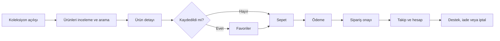

<div align="center">

<a href="README.md"></a>


# ALOTHING

### Her gardırop için özenle hazırlanmış bir moda alışveriş deneyimi

<p>Koleksiyonları keşfedin, ürün detaylarını inceleyin, favorilerinizi kaydedin, sepetinizi yönetin ve her siparişinizi tek bir şık mağaza deneyimi üzerinden takip edin.</p>

<a href="http://localhost/alothing/index.html">Mağazayı Aç</a>
&nbsp;&nbsp;•&nbsp;&nbsp;
<a href="admin/index.html">Yönetim Panelini İncele</a>

<br><br>


</div>

<br>

<table align="center">
<tr>
<td align="center" width="25%"><strong>01</strong><br><sub>Özenle seçilmiş mağazalar</sub></td>
<td align="center" width="25%"><strong>02</strong><br><sub>Eksiksiz alışveriş akışı</sub></td>
<td align="center" width="25%"><strong>03</strong><br><sub>Müşteri self-servisi</sub></td>
<td align="center" width="25%"><strong>04</strong><br><sub>Operasyon yönetim merkezi</sub></td>
</tr>
</table>

> **Proje durumu** — Yerel geliştirme için işlevsel bir e-ticaret uygulamasıdır. Üretimde kullanmadan önce [Üretim Öncesi Gereklilikler](#üretim-öncesi-gereklilikler) bölümünde açıklanan güvenlik, yapılandırma, ödeme ve veritabanı iyileştirmelerini tamamlayın.

## 📚 İçindekiler

- [Öne Çıkanlar](#öne-çıkanlar)
- [Uygulama Alanları](#uygulama-alanları)
- [Teknoloji Yığını](#teknoloji-yığını)
- [Proje Yapısı](#proje-yapısı)
- [Gereksinimler](#gereksinimler)
- [Yerel Kurulum](#yerel-kurulum)
- [Veritabanı](#veritabanı)
- [E-posta Yapılandırması](#e-posta-yapılandırması)
- [Ana Akışlar Nasıl Çalışır](#ana-akışlar-nasıl-çalışır)
- [API Referansı](#api-referansı)
- [Yönetim](#yönetim)
- [Geliştirme Notları](#geliştirme-notları)
- [Üretim Öncesi Gereklilikler](#üretim-öncesi-gereklilikler)
- [Bilinen Sınırlamalar](#bilinen-sınırlamalar)
- [İletişim ve Destek](#iletişim-ve-destek)

## ✨ Ürün Deneyimi

ALOTHING, eksiksiz alışveriş yolculuğunu tek ve tutarlı bir akışta bir araya getirir:



## 🛍️ Öne Çıkanlar

| Alışveriş | Hesap | Operasyonlar |
| --- | --- | --- |
| Kadın ve erkek koleksiyonları | Profil ve kayıtlı adresler | Dashboard analizleri |
| Arama, kategoriler, varyantlar ve indirimler | Sipariş geçmişi ve detayları | Ürün ve görsel yönetimi |
| Galeriler, favoriler, yorumlar ve stok bildirim talepleri | İptal ve iade talepleri | Beden bazında stok kontrolü |
| Sepet, kuponlar, kargo ve ödeme | Şifre ve e-posta değişiklikleri | Siparişler, kuponlar, kullanıcılar, mesajlar ve yorumlar |
| Herkese açık sipariş takibi | | Durum güncellemeleri ve bildirimler |

## 🧭 Uygulama Alanları

### 👗 Müşteri mağazası

| Alan | Sayfalar | Yetenekler |
| --- | --- | --- |
| Giriş ve keşif | `index.html`, `kadinAnasayfa.html`, `erkekAnasayfa.html`, `category.html` | Koleksiyon seçin, öne çıkan ürünlere göz atın, kategoriye göre filtreleyin ve ürün arayın. |
| Ürün alışverişi | `product-detail.html`, `favorites.html` | Galerileri ve varyantları görüntüleyin, beden seçin, ürünleri sepete ekleyin, favorilere kaydedin, yorumları okuyup gönderin ve stok bildirimi talep edin. |
| Ödeme | `checkout.html` | Adres seçin veya oluşturun, kargo ücretini hesaplayın, kupon uygulayın, sepeti inceleyin ve sipariş oluşturun. |
| Hesap | `account.html`, `order-detail.html` | Profil ve adresleri yönetin, siparişleri görüntüleyin, iptal/iade talep edin, giriş bilgilerini güncelleyin ve hesabı silin. |
| Teslimat | `order-tracking.html` | Siparişi herkese açık olarak sorgulayın ve kargo ilerlemesini görüntüleyin. |
| Destek ve bilgilendirme | `contact.html`, `faq.html`, `about.html`, `privacy.html`, `terms.html`, `returns-and-delivery.html` | Destek ekibiyle iletişime geçin, mağaza politikalarını ve bilgilendirme sayfalarını okuyun. |
| Kimlik doğrulama | `login.php`, `register.php`, `forgot-password.html`, `reset-password.html` | Kayıt olun, giriş yapın, şifre sıfırlama isteyin ve yeni bir şifre belirleyin. |

Ortak navigasyon ve footer bileşenleri frontend scriptleri tarafından `navbar.html` ve `footer.html` dosyalarından yüklenir.

### 🧰 Yönetim

`admin/` klasörü yönetim arayüzünü içerir:

- `index.html`: dashboard istatistikleri, satış grafiği, popüler ürünler, son siparişler ve hızlı işlemler.
- `orders.html`: siparişleri arayın ve yönetin, durumları güncelleyin, iptal/iade taleplerini işleyin ve takip kodları oluşturun.
- `products.html`: kategori, varyant, görsel ve model bilgileriyle ürün ekleyin, düzenleyin, silin ve yükleyin.
- `stocks.html`: tek tek bedenlerin stok sayılarını inceleyin ve toplu olarak güncelleyin.
- `users.html`: müşteri hesaplarını inceleyin ve silin.
- `coupons.html`: indirim kuponları oluşturun ve silin.
- `messages.html`: müşteri destek mesajlarını okuyun ve yanıt gönderin.
- `comments.html`: ürün yorumlarını onaylayın, reddedin, gizleyin veya yeniden yayınlayın.

## ⚙️ Teknoloji Yığını

- **Frontend:** HTML5, CSS3, vanilla JavaScript, Bootstrap 5 varlıkları, Lightbox ve yönetim dashboard'unda CDN üzerinden Chart.js.
- **Backend:** `mysqli`, JSON istek/yanıt gövdeleri, PHP session'ları ve parola hash'leri kullanan PHP endpoint scriptleri.
- **Veritabanı:** MySQL veya MariaDB. Uygulama şu anda `alothing_db` adlı bir veritabanı bekler.
- **E-posta:** Yerel olarak `PHPMailer/src` klasöründe bulunan PHPMailer, Gmail SMTP üzerinden STARTTLS için yapılandırılmıştır.
- **Çalışma ortamı:** Yerel geliştirme için XAMPP üzerinden Apache ve PHP.

Şu anda `composer.json`, SQL dökümü, migration sistemi, environment dosyası, otomatik test paketi veya build adımı bulunmamaktadır.

<table>
<tr>
<td width="50%">

### 🚀 Hızlı başlangıç

```text
1. XAMPP'te Apache ve MySQL'i başlatın
2. alothing_db veritabanını oluşturun
3. Veritabanı ve SMTP ayarlarını yapılandırın
4. http://localhost/alothing/index.html adresini açın
```

</td>
<td width="50%">

### 🖥️ Ortam

| Servis | Yerel değer |
| --- | --- |
| Web sunucusu | Apache |
| Veritabanı | MySQL / MariaDB |
| PHP API | PHP 8+ |
| E-posta aktarımı | Gmail SMTP / STARTTLS |

</td>
</tr>
</table>

## 🗂️ Proje Yapısı

```text
alothing/
├── index.html                  # Cinsiyet seçimli giriş noktası
├── kadinAnasayfa.html          # Kadın mağazası
├── erkekAnasayfa.html          # Erkek mağazası
├── category.html               # Katalog ve arama görünümü
├── product-detail.html         # Ürün detayları ve yorumlar
├── checkout.html               # Sepet ödemesi
├── account.html                # Müşteri hesap alanı
├── order-detail.html           # Müşteri sipariş detayları
├── order-tracking.html         # Herkese açık takip sayfası
├── admin/                      # Yönetim dashboard'u ve yönetim görünümleri
├── css/                        # Bootstrap, Lightbox ve uygulama stilleri
├── js/                         # Sepet, kimlik doğrulama, katalog, ödeme, hesap ve arayüz mantığı
├── images/                     # Mağaza ve ürün görselleri
├── PHPMailer/src/              # Vendored PHPMailer sınıfları
├── *.php                       # JSON API'leri ve sunucu tarafı işlemler
└── README.md
```

## ✅ Gereksinimler

- Apache, PHP ve MySQL/MariaDB içeren [XAMPP](https://www.apachefriends.org/) kurulu bir Windows ortamı.
- `mysqli`, JSON, session, parola hash'leme ve OpenSSL için PHP uzantıları.
- Ürün görselleri için uygun PHP yükleme limitleri (`upload_max_filesize` ve `post_max_size`).
- JavaScript etkin bir tarayıcı.
- PHP scriptlerinde yapılandırılmış bir Gmail SMTP hesabı veya başka bir SMTP servisi.

## 💻 Yerel Kurulum

1. Projeyi XAMPP web kök dizinine kopyalayın:

	```text
	C:\xampp\htdocs\alothing
	```

2. **XAMPP Control Panel** üzerinden **Apache** ve **MySQL**'i başlatın.

3. phpMyAdmin veya MySQL konsolunda `alothing_db` adlı bir MySQL veritabanı oluşturun.

4. [Veritabanı](#veritabanı) bölümünde açıklanan tabloları oluşturun. Depoda schema veya seed SQL dosyası bulunmadığından veritabanı ayrıca hazırlanmalıdır.

5. Tüm PHP bağlantı ifadelerini inceleyin. Mevcut varsayılan bağlantı:

	```php
	new mysqli("localhost", "root", "", "alothing_db");
	```

	Bu ayar, yerel XAMPP `root` kullanıcısının boş parolaya sahip olduğunu varsayar.

6. SMTP'yi [E-posta Yapılandırması](#e-posta-yapılandırması) bölümündeki gibi yapılandırın.

7. Uygulamayı doğrudan HTML dosyası açarak değil Apache üzerinden çalıştırın:

	```text
	http://localhost/alothing/index.html
	```

8. Bir kullanıcı oluşturun ve yönetim arayüzüne erişmek için `role` sütununu `admin` olarak ayarlayın.

## 🗄️ Veritabanı

Aşağıdaki schema uygulamada kullanılan SQL sorgularından çıkarılmıştır. Tablo türleri ve indeksler uygun şekilde seçilmelidir.

| Tablo | Önemli sütunlar | Amaç |
| --- | --- | --- |
| `users` | `id`, `full_name`, `name`, `surname`, `email`, `password`, `phone`, `gender`, `tc_no`, `address`, `city`, `district`, `role`, `reset_token`, `reset_expires`, `created_at` | Müşteri hesapları ve roller. |
| `products` | `id`, `name`, `ref`, `category`, `price`, `old_price`, `discount`, `images`, `sizes`, `colors`, `model_info`, `color_group_id` | Ürün kataloğu ve varyant bilgileri. |
| `product_stocks` | `id`, `product_id`, `size`, `stock_count` | Ürün ve beden bazında stok. Stok senkronizasyonu için `(product_id, size)` üzerinde benzersiz anahtar beklenir. |
| `orders` | `id`, `user_email`, `phone`, `order_code`, `items`, `total_price`, teslimat alanları, `status`, `tracking_code`, `cancel_reason`, `created_at` | Siparişler, JSON olarak saklanan ürünler, teslimat bilgileri ve sipariş durumu. |
| `addresses` | `id`, `user_email`, `address_title`, `name`, `surname`, `phone`, `address_line`, `zip_code`, `city`, `district` | Kayıtlı müşteri adresleri. |
| `favorites` | `id`, `email`, `product_id` | Müşterinin kaydettiği ürünler. |
| `product_comments` | `id`, `product_id`, `user_email`, `user_name`, `rating`, `comment`, `status`, `created_at` | Ürün yorumları, moderasyon durumu. |
| `coupons` | `id`, `code`, `discount_type`, `discount_value`, `min_cart_amount`, `created_at` | İndirim kodları. |
| `contact_messages` | `id`, `name`, `email`, `order_no`, `message`, `status`, `admin_reply`, `reply_date`, `created_at` | Müşteri destek görüşmeleri. |
| `stock_requests` | `id`, `user_email`, `product_id`, `size`, `status` | Stok bildirim talepleri. |

### Önemli schema notu

`register.php`, `full_name` alanına yazarken diğer hesap işlemleri `name` ve `surname` alanlarına da başvurur. Profil verilerine güvenmeden önce bu adlandırma yaklaşımını veritabanı ve PHP endpoint'lerinde uyumlu hale getirin. Ürün kategorileri, görselleri ve bedenleri şu anda virgülle ayrılmış değerler olarak, renkler JSON olarak, sipariş ürünleri ise JSON metni olarak saklanabilir.

## ✉️ E-posta Yapılandırması

`send_mail.php`, `sendOrderEmail($to, $subject, $htmlContent)` yardımcı fonksiyonunu sunar. PHPMailer şu işlemlerde kullanılır:

- `create_order.php` başarılı olduktan sonra sipariş onayı.
- `update_status.php` tarafından gönderim, teslimat, iptal ve iade bildirimleri.
- `forgot_password.php` tarafından parola sıfırlama mesajları.
- İlgili yönetim akışında stok bildirim mesajları.

Mevcut uygulama Gmail SMTP'yi hedefler:

```text
Sunucu: smtp.gmail.com
Port: 587
Şifreleme: STARTTLS
Kimlik doğrulama: etkin
```

Uygulamayı kullanmadan önce `send_mail.php` ve `forgot_password.php` içindeki sabit hesap bilgilerini bir Gmail uygulama parolası veya başka bir SMTP sağlayıcısıyla değiştirin. Gerçek kimlik bilgilerini commit etmeyin. Gönderici adresi ve e-posta şablonlarındaki bağlantılar da yerel geliştirme adresleri yerine HTTPS kullanan yayın alan adıyla değiştirilmelidir.

## 🔄 Ana Akışlar Nasıl Çalışır

### Kimlik doğrulama

`js/login.js`, `register.php` ve `login.php` adreslerine JSON istekleri gönderir. Parolalar `password_hash()` ile hash'lenir ve `password_verify()` ile kontrol edilir. Başarılı giriş bir PHP session'ı oluşturur ve frontend durumu ile rol bazlı navigasyon için dönen kullanıcı nesnesini tarayıcı `localStorage`'ında saklar.

### Katalog ve sepet

`api.php`, ürünleri beden stoklarıyla birlikte döndürür. `js/category.js` ve `js/product-detail.js`, katalog ve ürün görünümlerini oluşturur. `js/cart.js`, seçili beden, miktar, fiyat ve görsel bilgilerini içeren sepet verisini `localStorage`'da tutar.

### Ödeme ve siparişler

`js/checkout.js`, müşteri, adres, sepet, kupon ve toplam bilgilerini `create_order.php` adresine gönderir. Endpoint, `ALO-######` biçiminde bir sipariş kodu oluşturur, siparişi kaydeder, eşleşen beden stoklarını azaltır ve sipariş onay e-postası göndermeyi dener. Herhangi bir ödeme sağlayıcısı veya ödeme doğrulaması yoktur: ödeme gönderildikten sonra doğrudan sipariş oluşturulur.

### Sipariş takibi

Yöneticiler `update_status.php` üzerinden sipariş durumunu güncelleyebilir. Sipariş kargoya verildi olarak işaretlendiğinde bir takip kodu oluşturulur. Müşteriler hesap alanında sipariş detaylarını görüntüleyebilir veya `order-tracking.html` üzerinden `track_order.php` kullanabilir.

## 🔌 API Referansı

Tüm endpoint'ler düz PHP scriptleridir. Çoğu yazma işlemi istek gövdesinde JSON bekler; okuma işlemleri genellikle query parametreleri kullanır ve JSON döndürür.

### Kimlik doğrulama ve hesap

| Endpoint | Metot | Amaç |
| --- | --- | --- |
| `register.php` | POST | Müşteri hesabı oluşturur. |
| `login.php` | POST | Kimlik bilgilerini doğrular ve PHP session'ı başlatır. |
| `forgot_password.php` | POST | Süreli sıfırlama token'ı oluşturur ve e-posta gönderir. |
| `reset_password.php` | POST | Sıfırlama token'ını doğrular ve parolayı değiştirir. |
| `get_profile.php` | GET | Bir e-posta adresine ait profil verisini döndürür. |
| `update_profile.php` | POST | Müşteri profil alanlarını günceller. |
| `update_email.php`, `change_email.php` | POST | Parola doğrulamasından sonra e-postayı değiştirir. |
| `update_password.php`, `change_password.php` | POST | Parola doğrulamasından sonra parolayı değiştirir. |
| `delete_account.php` | POST | Müşteri hesabını siler. |
| `get_addresses.php`, `add_address.php`, `update_address.php`, `delete_address.php` | GET/POST | Kayıtlı adresleri yönetir. |

### Ürünler, favoriler, yorumlar ve stok

| Endpoint | Metot | Amaç |
| --- | --- | --- |
| `api.php` | GET | Ürünleri beden stoklarıyla birlikte döndürür. |
| `get_all_products.php` | GET | Yönetim ürün listesini ve toplam stoğu döndürür. |
| `add_product.php`, `update_product.php`, `delete_product.php` | POST | Ürün CRUD ve görsel yükleme işlemlerini gerçekleştirir. |
| `get_favorites.php`, `toggle_favorite.php` | GET/POST | Kayıtlı ürünleri okur ve günceller. |
| `get_comments.php`, `add_comment.php` | GET/POST | Ürün yorumlarını okur ve gönderir. |
| `admin_manage_comments.php` | GET/POST | Yorumları listeler ve moderasyonunu yapar. |
| `get_stocks.php`, `update_stocks_api.php`, `update_stock_bulk.php` | GET/POST | Stokları inceler ve günceller. |
| `sync_stocks.php` | GET/POST | Ürün bedenlerini stok satırlarıyla senkronize eder. |
| `randomize_stocks.php` | GET/POST | Geliştirme/test için rastgele stok değerleri atar. |
| `request_stock.php` | POST | Stok bildirim talebi oluşturur. |

### Siparişler, destek ve kuponlar

| Endpoint | Metot | Amaç |
| --- | --- | --- |
| `create_order.php` | POST | Sipariş oluşturur, stoğu azaltır ve onay e-postası gönderir. |
| `get_orders.php`, `get_order_detail.php` | GET | Müşteri siparişlerini ve tek bir sipariş detayını döndürür. |
| `update_order_request.php`, `cancel_order.php` | POST | İptal veya iade işlemleri gönderir ya da işler. |
| `get_all_orders.php`, `update_status.php` | GET/POST | Yönetici sipariş yönetimi ve durum bildirimlerini yürütür. |
| `track_order.php` | GET | Herkese açık sipariş/takip sorgusu yapar. |
| `get_dashboard_stats.php` | GET | Yönetim dashboard toplamlarını döndürür. |
| `add_coupon.php`, `get_all_coupons.php`, `delete_coupon.php` | GET/POST | İndirim kuponlarını yönetir. |
| `submit_contact.php`, `get_my_messages.php` | POST/GET | Müşteri destek mesajlarını gönderir ve görüntüler. |
| `get_all_messages.php`, `reply_message.php` | GET/POST | Yönetim destek gelen kutusunu ve yanıtlarını yönetir. |

## 🛠️ Geliştirme Notları

- Tüm testlerde Apache URL'lerini kullanın; PHP ve `fetch()` çağrıları `file://` sayfalarında doğru çalışmaz.
- Frontend; sepet, favoriler/oturum gösterimi ve arama geçmişi için tarayıcı `localStorage`'ını kullanır; site verilerini temizlemek bu yerel durumu siler.
- Ürün görsel yüklemeleri PHP ürün endpoint'leri tarafından işlenir ve proje görsel klasörlerinde saklanır.
- Ürün bedenlerini değiştirdikten sonra `product_stocks` tablosunun uyumlu kalması için `sync_stocks.php` çalıştırılmalıdır.
- `randomize_stocks.php` geliştirme/test amaçlıdır ve canlı ortamda erişime açık olmamalıdır.
- Tarayıcı tarafındaki yönetici yönlendirmeleri yalnızca kolaylık sağlar, güvenlik sınırı değildir.

## ⚠️ Üretim Öncesi Gereklilikler

<table>
<tr>
<td><strong>Uyarı</strong><br>Mevcut kod tabanını olduğu gibi canlıya almayın.</td>
<td>Gerçek müşteriler veya ödemelerle çalışmadan önce aşağıdaki güvenlik, ödeme, yapılandırma ve veritabanı iyileştirmelerini tamamlayın.</td>
</tr>
</table>

Gerçek müşteriler veya ödemelerle çalışmadan önce en azından şunları yapın:

1. Veritabanı ve SMTP bilgilerini yalnızca sunucu tarafında bulunan environment/yapılandırma değişkenlerine taşıyın ve kaynak dosyalarda bulunan bilgileri yenileyin.
2. Her yönetim endpoint'ine sunucu tarafında session ve rol yetkilendirmesi ekleyin. Yetkilendirme için `localStorage`'a veya istemcinin gönderdiği e-posta adresine güvenmeyin.
3. Her yerde string birleştirmeli SQL yerine prepared statement kullanın; tüm ID, e-posta, miktar, yüklenen dosya ve query parametrelerini doğrulayın.
4. CSRF koruması, rate limiting, güvenli session çerezleri, HTTPS zorlaması, güvenlik başlıkları ve tutarlı hata loglama ekleyin. Geliştirme dışında `display_errors` özelliğini kapatın.
5. HTML'e yazdırılan kullanıcı verilerini escape edin; ürün görsellerinin MIME türünü, uzantısını, boyutunu, depolama konumunu ve çalıştırma izinlerini doğrulayın.
6. Fiyatları, indirimleri, kupon uygunluğunu ve stok durumunu sunucuda yeniden hesaplayın. Stok yetersiz olduğunda rollback yapılacak şekilde sipariş oluşturma ve stok düşme işlemlerinde veritabanı transaction'ı kullanın.
7. Checkout'u ödenmiş olarak tanımlamadan önce gerçek bir ödeme sağlayıcısı entegre edin ve doğrulayın. Mevcut checkout bir ödeme yöntemi tahsil etmeden sipariş oluşturur.
8. Sürümlendirilmiş bir schema/migration dosyası, başlangıç verileri, yedekler, dağıtım yapılandırması ve otomatik testler ekleyin.
9. Politika sayfalarını gerçek uygulamayla karşılaştırın. Ödeme, SSL, kargo firması veya üçüncü taraf entegrasyonlarına yapılan atıflar gerçekten yapılandırılmış hizmetlerle eşleşmelidir.

## 📌 Bilinen Sınırlamalar

| Durum | Ayrıntı |
| --- | --- |
| Uygulanmadı | Ödeme sağlayıcısı bulunmamaktadır. |
| Dahil değil | Veritabanı schema'sı, başlangıç dosyası, otomatik test ve bağımlılık lockfile'ı bulunmamaktadır. |
| Güvenlik açığı | Bazı endpoint yetkilendirmeleri tarayıcıdan gönderilen değerlere dayanır. |
| Doğrulama açığı | Sipariş toplamları ve ürün satırları istemciden kabul edilir; sunucu tarafında doğrulanmaları gerekir. |
| Tutarlılık açığı | Eş zamanlı siparişlerde stok düşme işlemi tamamen transaction'lı değildir. |
| Geliştirme amaçlı | Hata çıktıları ve yerel URL'ler mevcut kod tabanında kalmıştır. |
| Eksik endpoint | `login.js`, `logout.php` dosyası bulunmamasına rağmen çıkış akışına başvurur. |

## 📬 İletişim ve Destek

<table>
<tr>
<td align="center" width="33%"><strong>Proje</strong><br><sub>ALOTHING</sub></td>
<td align="center" width="33%"><strong>Destek</strong><br><sub>Uygulama içi iletişim formunu kullanın</sub></td>
<td align="center" width="33%"><strong>Yönetici erişimi</strong><br><sub><code>admin/index.html</code> dosyasını açın</sub></td>
</tr>
</table>

Müşteri soruları için `contact.html` sayfasını kullanın ve hesap alanından yanıtları takip edin. Geliştirme sorunları için GitHub Issue açın veya bu depoyu yayınlamadan önce aşağıdaki proje sorumlusu bilgilerini güncelleyin:

```text
Proje sorumlusu: [Yasin "Eswaii" Şahin]
E-posta:         [yasinsahintr@outlook.com]
Depo:            [https://github.com/Eswaii/Alothing]
```

## 📄 Lisans

Şu anda bir lisans dosyası bulunmamaktadır. Projeyi herkese açık olarak dağıtmadan veya yayınlamadan önce bir lisans ekleyin.
